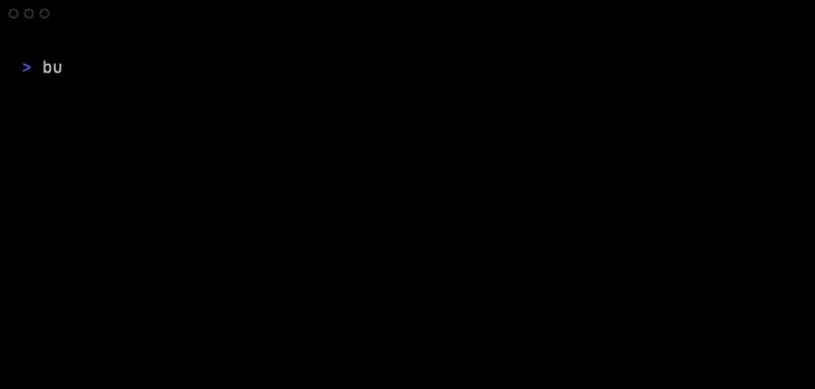

# busq

[](https://github.com/matheuseabra/busq/actions/workflows/ci.yml)
[](https://github.com/matheuseabra/busq/releases/latest)

`busq` (*busque*, Portuguese for “search”) is a tiny, pane-aware system-info readout for terminals. It prints
the shortest useful summary of a machine that still fits in a small pane.



The project is early-stage. macOS and Linux are the primary targets; the
current implementation is a single-shot readout with plain-text output,
opt-in icons and logo, and width-aware rendering.

## Build and run

Requires a current stable Rust toolchain.

```sh
cargo run --release
cargo test --release
cargo install --path .
```

Homebrew can install the tagged public release through a tap:

```sh
brew tap matheuseabra/busq https://github.com/matheuseabra/busq.git
brew install matheuseabra/busq/busq
```

Useful flags:

```text
--help                 Show usage
--version              Show the version
--config PATH          Load optional defaults from a config file
--icons on|off|nerd    Select portable Unicode, no icons (default), or Nerd Font icons
--color-no             Disable color output
--color auto|always|never
                       Select color behavior (never emits ANSI when piped)
--theme subtle|mono    Select the color theme (otherwise detect a terminal hint)
--interactive, -i      Refresh every second; press q to quit (TTY only)
--probe                Dump platform, terminal, row, and error detection
--json                 Emit rows as JSON (feature build only)
--no-term              Omit the uptime row
--no-terminator        Omit the final newline
--verbose              Print fetch failures to stderr
--logo [none|auto|PATH]
                       Show the built-in OS logo, disable it, or load a file
```

Piped output is plain text and never includes ANSI escapes or the logo.
Icons and the built-in OS ASCII logo are also off by default; enable either with
`--icons on|nerd` and `--logo`.

An optional config file at `$XDG_CONFIG_HOME/busq/config` (or
`$HOME/.config/busq/config`) accepts `color`, `icons`, `logo`, `rows`, and
`theme` keys as `key = value`; command-line flags override its defaults. Use
`--config PATH` to select another file.

Without an explicit theme, a TTY `COLORFGBG` hint selects `subtle` for dark ANSI
backgrounds (`0`–`6` and `8`) or `mono` for light backgrounds (`7` and `15`); missing
or malformed hints fall back to `subtle`. Piped output and `NO_COLOR` remain
ANSI-free.

JSON output is feature-gated: build with `cargo build --features json` before
using `--json`.

## tmux and zsh

Install `busq` so it is on your `PATH`, then run it in a pane:

```sh
tmux split-window -h 'busq --no-term'
```

For a compact plain-text pane, use:

```sh
busq --no-term --no-icons --color never
```

`busq` takes one snapshot and exits by default. `busq --interactive` refreshes the same
readout every second; press `q` to quit.

## Project direction

See [`docs/VISION.md`](docs/VISION.md) for the product direction
and [`docs/ROADMAP.md`](docs/ROADMAP.md) for the quality-gated plan. See the
[`user reference`](docs/REFERENCE.md) for flags, configuration, and layout behavior, and
[`CHANGELOG.md`](CHANGELOG.md) / [`release guide`](docs/RELEASING.md) for releases.

## Contributing

Small, focused changes are welcome. Start with [`CONTRIBUTING.md`](CONTRIBUTING.md),
run the local checks, and explain platform-specific behavior in the pull
request.

## License

MIT. See [`LICENSE`](LICENSE).
